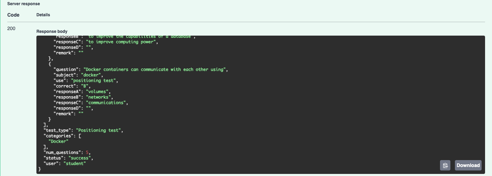
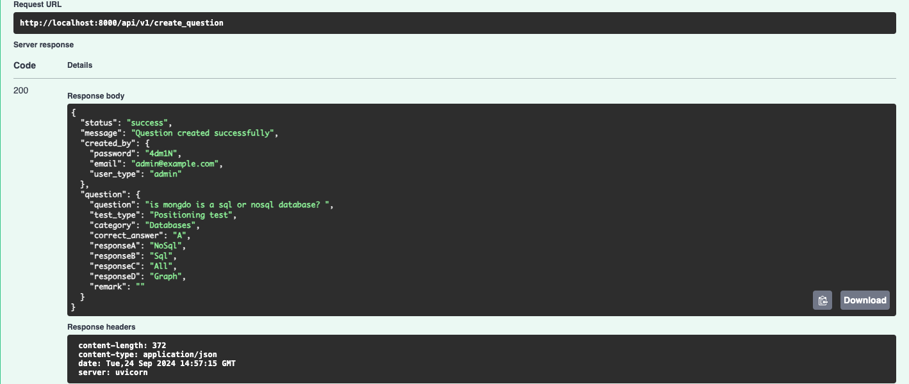
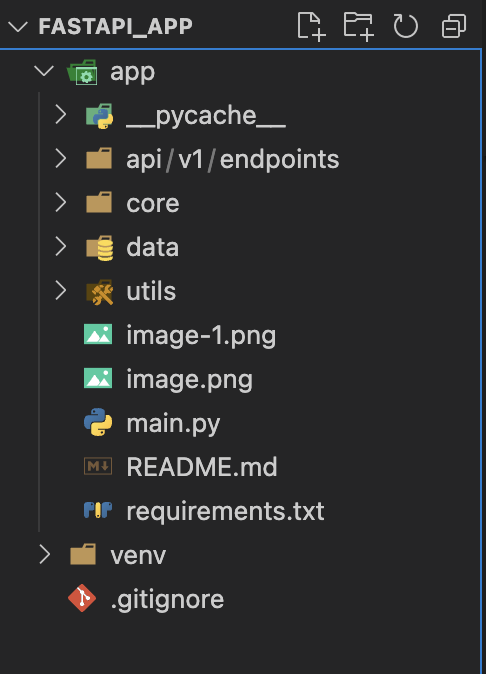

## Admin Access:
- GET /api/v1/users: : Should return a user which is authenticated for that moment or ask username and password.
- POST /api/v1/generate_mcqs: Admin can generate the mcqs
- POST /api/v1/create_question: Admin can create the questions

## Student Access:
GET /api/v1/login with Basic Auth (alice/wonderland): Should return a message confirming the student login.
POST /api/v1/generate_mcqs with Basic Auth (alice/wonderland): Should return list of question asked.

# 1 Basic Authentication in FastAPI (HTTPBASIC)
## What is Basic Authentication?
- Basic Authentication is a simple authentication mechanism where the client (like a browser or API client) sends the username and password encoded in the HTTP request header using the Authorization header. The format looks like:
`Authorization: Basic <base64-encoded-username-and-password>`

*FastAPI provides built-in support for Basic Authentication using the HTTPBasic class.*

## What is a Router in FastAPI?
- A router in FastAPI is a way to organize your endpoints (API routes) into different, modular pieces. It allows you to split your API logic across multiple files or components and makes your application more maintainable, especially as it grows.

Routers provide a way to:

- Group related endpoints.
- Make your code modular and easy to manage.
- Reuse logic across different parts of the app (like dependencies, security, etc.).
- Keep your main.py file clean and minimal.
- Add versioning: By having routers, it's easier to version your API (like v1, v2).
- Test and maintain: Routers make it easier to test individual components of the API separately.

## How Routers Work in FastAPI

- A router in FastAPI is essentially an object of the class APIRouter. You define routes within that router and then register (or include) the router in the main FastAPI app. Each router can have its own set of routes and even its own dependencies, middlewares, or tags.


## Basic Router Implementation
**users.py**
```
from fastapi import APIRouter, Depends

router = APIRouter()

@router.get("/users")
def get_users():
    return [{"name": "Alice"}, {"name": "Bob"}]

@router.get("/users/me")
def get_user_me():
    return {"name": "This is the current user"}
```

- This router defines two endpoints:
    - /users: returns a list of users.
    - /users/me: returns the current user's information.

**main.py**
```
from fastapi import FastAPI
from app.api.v1.endpoints import users

app = FastAPI()

# Include the router with a prefix `/api/v1`
app.include_router(users.router, prefix="/api/v1", tags=["Users"])

@app.get("/")
def read_root():
    return {"message": "Welcome to the FastAPI Application"}
```

# generate mcq from user: student



# Create Question using Admin User


## Update Question
- Question will be added to Excel sheets after creation of questions and answers.

## Run the following code.
```
    main.py
```



The root folder is FASTAPI_APP: Run the following command to get your uvicorn server running. Or click Run btn in main.py from your IDE.

```
uvicorn app.main:app --reload
```

# Request Body
## For Student login

```
{
  "test_type": "Positioning test",
  "categories": [
    "Databases"
  ],
  "num_questions": 5
}
```
## For Admin Login
```
{
  "question": "is mongdo is a sql or nosql database? ",
  "test_type": "Positioning test",
  "category": [
    "Databases"
  ],
  "correct_answer": "A",
  "responseA": "NoSql",
  "responseB": "Sql",
  "responseC": "All",
  "responseD": "Graph",
  "remark": ""
}
```


docker build -t fastapi-lambda:test .
docker run -p 8000:8000 -- fastapi-lambda:test


docker pull 260320279955.dkr.ecr.eu-west-3.amazonaws.com/fastapi-deploy:lambda
docker run --platform linux/amd64 -p 8000:8000 260320279955.dkr.ecr.eu-west-3.amazonaws.com/fastapi-deploy:lambda
